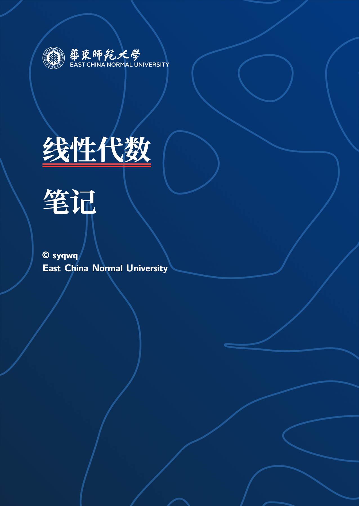
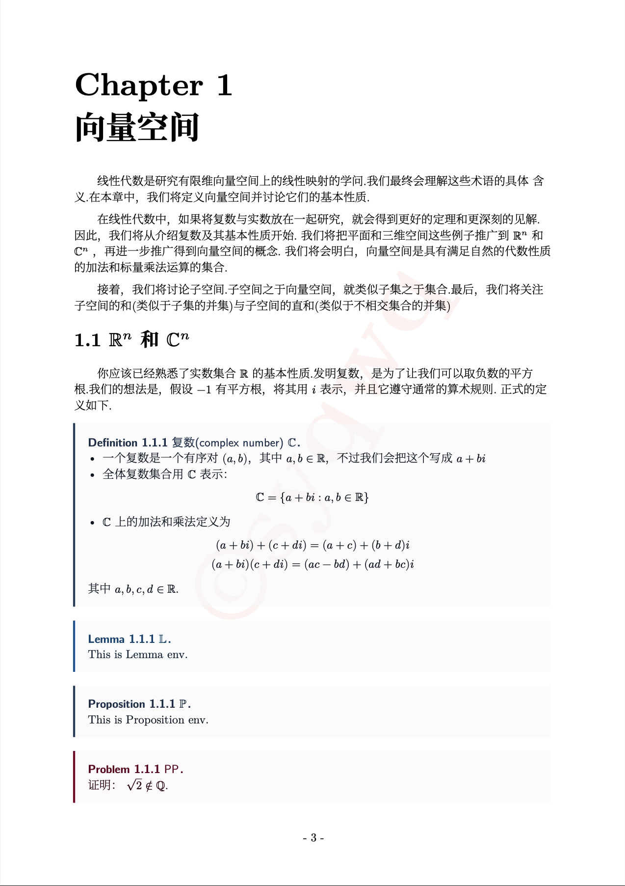
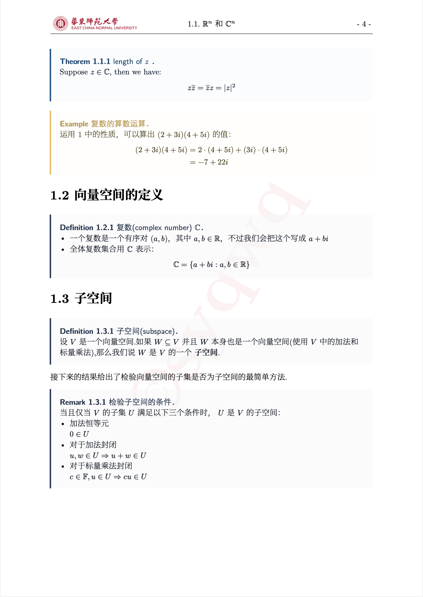
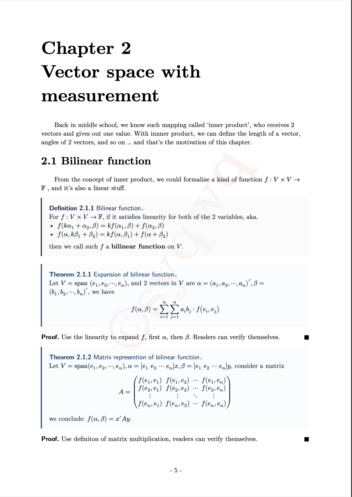

# notes-template
notes template in typst

## features
- env for def, thm, problem, proof, sol, lemma etc.
- school logo
- auto numbering
- support watermark
- some .svg pics can be used as cover in src directory

## previews

---
author: syqwq
